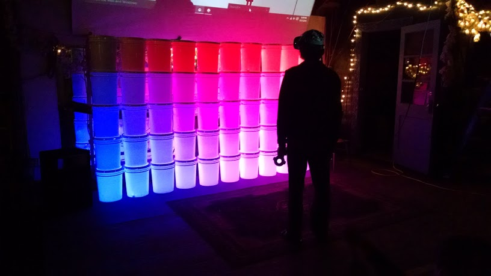

# internet-of-buckets

> http wrapper for controlling *The Internet of Buckets* art installation

*The Internet of Buckets* is a 10x5 stack of buckets with RGB LEDs inside. Each
is controlled independently by a microcontroller with its own IP address, which
responds to HTTP requests. This module wraps the process of addressing and
routing to each bucket.

There are a small variety of demos under `examples/`.

## Usage

Let's draw a gradient:

```js
var draw = require('internet-of-buckets')

for (var i=0; i < 10; i++) {
  for (var j=0; j < 5; j++) {
    var red = 255 * i / 10
    var green = 0
    var blue = 255 - 255 * j / 5
    draw(i, j, [red, green, blue])
  }
}
```

This will output



## API

```js
var draw = require('internet-of-buckets')
```

### draw(x, y, rgb, cb=function noop(){})

Sets a single bucket at `(x, y)` to the colour `rgb`.

The top left corner is `(0, 0)`, and the bottom right corner is `(9, 4)`.

`rgb` is an array of size 3, with values between `0-255`. It represents the red,
green, and blue components respectively.

If provided, `cb` is a function that will be called once the write is complete.
This can be be useful for e.g. synchronizing several buckets' updates.


## Install

With [npm](https://npmjs.org/) installed, run

```
$ npm install internet-of-buckets
```

## License

ISC

